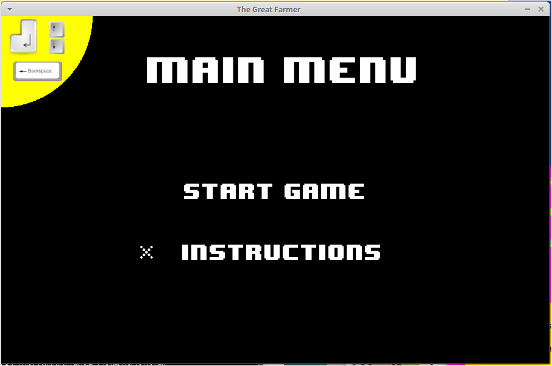
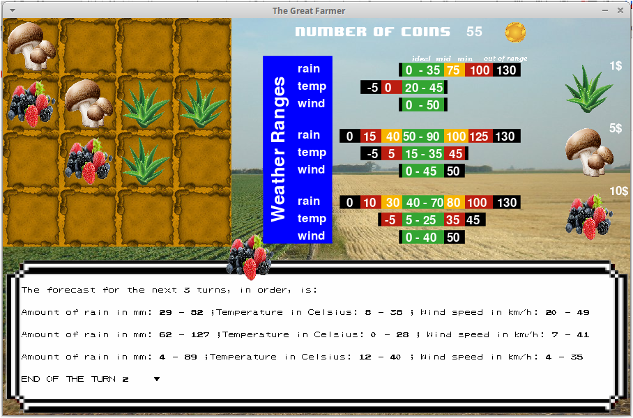

Welcome to my first videogame made completely using Python and functions/modules from the Pygame library!!

This videogame has a graphical interface in which you'll find 3 types of crop and 16 parcels to plant them.
The weather changes for each turn and each crop adapts differntly to each forecast so you should take that 
into account before choosing which of the crops you'll spend money on.I built this game for my first course
of programming in college (Faculty of Engineering - University of Buenos Aires).

&nbsp;&nbsp; 

